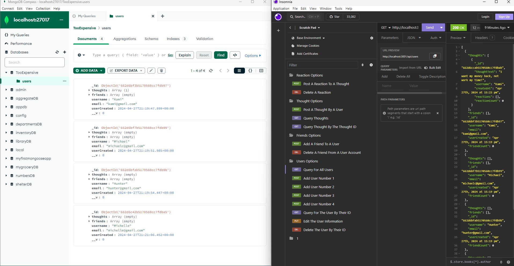

# Challenge 18 NoSQL Social Network API

[Project Video](https://youtu.be/7uKU1qCE4BM)

## Description
I created an API application for a social network. There are routes for creating users, updating users, and deleting users, creating and deleting thoughts and reactions, and adding and deleting friends. No front-end is required for this challenge; all routes have been tested using Insomnia.

## Table of Contents
- [Installation](#installation)
- [Usage](#usage)
- [License](#license)
- [Contributing](#contributing)
- [Tests](#tests)
- [Questions](#questions)

## Installation
Install these dependencies when you want to run the application. MongoDB, Mongoose, Javascript, Express.

## Usage
The only way to test this application is to use Insomnia software. Watch the YouTube video for more instructions.

## License
This project is licensed under the MIT license.

## Contributing
My Tutoring!!!

## Tests
Install the dependencies, download Insomnia software and watch the Youtube videos for further instructions.

## Questions
For any questions regarding the project, contact michaelchiem@hotmail.com.

[Project Link](https://github.com/Michael-Chiem/FoodIsMyWeakness)

[Project Video](https://youtu.be/7uKU1qCE4BM)

